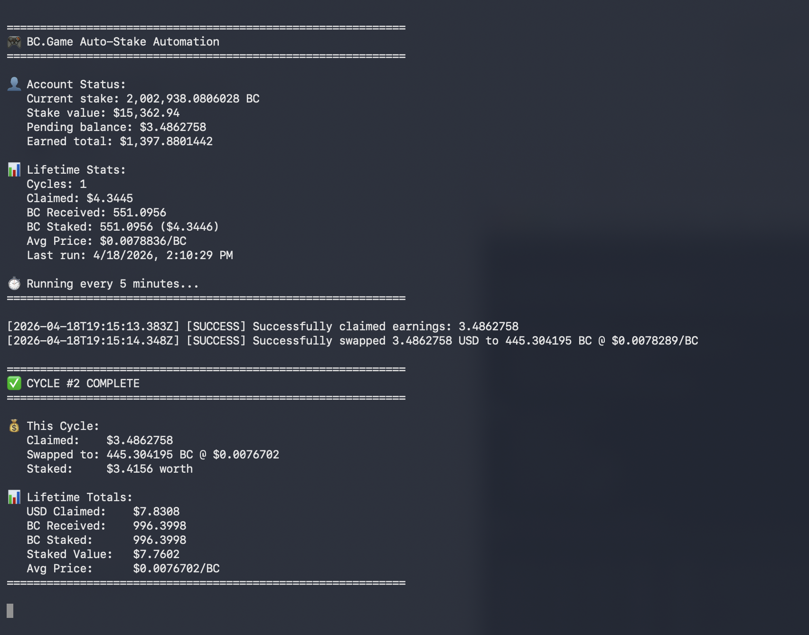

# BC.Game Engine Auto-Stake Automation

Automatically claim earnings, swap to BC tokens, and stake them every 5 minutes.



## Features

✅ **Automated Workflow**
- Monitors pending earnings
- Claims when available
- Swaps USD → BC
- Automatically stakes
- Every 5 minutes

✅ **State Persistence**
- Saves progress after each step
- Resumes if interrupted
- Never loses claimed amounts

✅ **Lifetime Stats**
- Tracks total USD claimed
- Tracks total BC received
- Tracks total BC staked
- Cycle count
- Average BC price

✅ **Interactive Dashboard**
- View real-time charts in your browser
- 4 interactive visualizations
- Daily earnings vs staked
- Cumulative growth over time
- Net position tracking

✅ **History Export**
- Export all transaction history
- Daily summaries (earnings, staked, totals)
- CSV & JSON formats
- Excel workbook with professional formatting
- Perfect for detailed analysis

<details>
<summary>Docker Setup</summary>

## Docker Setup

Docker is the easiest way to run this on another machine because it installs the Node dependencies inside the container.

### 1. Clone the Repo

```bash
git clone <your-repo-url>
cd bc-game-automation
```

### 2. Create `.env`

```bash
cp .env.example .env
```

Open `.env` and set:

```bash
BC_GAME_COOKIES=your_full_cookie_string_here
```

To get the cookie value:

1. Open https://bc.game in Chrome
2. Log in to your account
3. Press `F12` and open the Network tab
4. Make any request on the page
5. Click that request, open Headers, and copy the full `Cookie:` header value

### 3. Run with Docker

**macOS/Linux:**

```bash
docker compose --env-file /dev/null up --build
```

**Windows PowerShell:**

```powershell
docker compose --env-file NUL up --build
```

Use `--env-file /dev/null` on macOS/Linux or `--env-file NUL` on Windows because BC.Game cookies can contain `$` characters. This prevents Docker Compose from trying to treat parts of the cookie as variables while still letting the container read `./.env`.

Docker will automatically create a local `docker-data/` folder if it does not exist. Runtime files are stored there:

- `docker-data/.bc-game-state.json` - Current recovery state, when a cycle is mid-progress
- `docker-data/.bc-game-stats.json` - Lifetime stats
- `docker-data/bc-game.log` - Automation log
- `docker-data/api-responses/` - Saved API responses

Stop it with:

**macOS/Linux:**

```bash
docker compose --env-file /dev/null down
```

**Windows PowerShell:**

```powershell
docker compose --env-file NUL down
```

To view logs:

**macOS/Linux:**

```bash
docker compose --env-file /dev/null logs -f
```

**Windows PowerShell:**

```powershell
docker compose --env-file NUL logs -f
```

</details>

<details>
<summary>Local Setup</summary>

## Local Setup

### 1. Install Dependencies

```bash
cd /Users/saint/dev/bc-game-automation
npm install
```

### 2. Get Your Cookies

1. Open https://bc.game in Chrome
2. Log in to your account
3. Press `F12` → Network tab
4. Make any request on the page
5. Click that request → Headers → find `Cookie:` header
6. Copy the entire value

### 3. Create .env File

```bash
cat > .env << 'EOF'
BC_GAME_COOKIES=your_full_cookie_string_here
EOF
```

Replace `your_full_cookie_string_here` with the Cookie header value from step 2.

### 4. Run It

**Start automation (foreground):**
```bash
npm start
```

**Start automation (background):**
```bash
nohup npm start > bc-game.log 2>&1 &
```

**View interactive dashboard with charts:**
```bash
npm run dashboard
```
Opens `bc-game-dashboard.html` in your browser with 4 interactive charts

**Export history to Excel (CSV + JSON):**
```bash
npm run export-history
```

**View automation logs:**
```bash
tail -f bc-game.log
```

**Stop background automation:**
```bash
pkill -f "node src/index.js"
```

</details>

## How It Works

### The Automation Cycle

Every 5 minutes, the script:

1. **Check Pending Balance** - Queries your account for unclaimed earnings
2. **Claim Earnings** - If there are pending earnings, claims them as USD
3. **Swap USD → BC** - Converts the claimed USD to BC tokens at current market price
4. **Preview Stake** - Shows what will happen when you stake
5. **Execute Stake** - Actually stakes the BC tokens in your account
6. **Update Stats** - Saves earnings, amounts staked, prices, and timestamps

### Example: What You'll See

**On startup:**
```
============================================================
🎮 BC.Game Auto-Stake Automation
============================================================

👤 Account Status:
   Current stake: 2,002,938.0806028 BC
   Stake value: $15,452.67
   Pending balance: $0
   Earned total: $1,394.3938684

📊 Lifetime Stats:
   Cycles: 1
   Claimed: $4.3445
   BC Received: 551.0956
   BC Staked: 551.0956 ($4.3446)
   Avg Price: $0.0078836/BC
   Last run: 4/18/2026, 2:10:29 PM

⏱️  Running every 5 minutes...
============================================================
```

**When a cycle completes successfully:**
```
============================================================
✅ CYCLE #2 COMPLETE
============================================================

💰 This Cycle:
   Claimed:    $5.2341
   Swapped to: 625.4521 BC @ $0.008357
   Staked:     $5.2341 worth

📊 Lifetime Totals:
   USD Claimed:    $9.5786
   BC Received:    1,176.5477
   BC Staked:      1,176.5477
   Staked Value:   $9.8256
   Avg Price:      $0.008356/BC
============================================================
```

**When there's nothing to claim (continues quietly, retries in 5 min):**
```
No pending balance to claim
```

### Behind the Scenes

All detailed operation logs go to `bc-game.log` for debugging:
```
[2026-04-18T14:24:53.394Z] [DEBUG] Fetching user info. Pending balance: 5.2341
[2026-04-18T14:24:53.501Z] [DEBUG] Successfully claimed earnings: 5.2341
[2026-04-18T14:24:54.203Z] [DEBUG] Swapped with current price: $0.008357/BC (token estimate: 625)
[2026-04-18T14:24:54.890Z] [DEBUG] Preview: Staking 625.4521 BCD → Total after: 2,003,563.53
[2026-04-18T14:24:55.123Z] [DEBUG] Successfully staked 625.4521 BCD → Total: 2,003,563.53
```

<details>
<summary>Project Structure</summary>

## Project Structure

**Core Files:**
- `src/index.js` - Main automation entry point
- `package.json` - Dependencies and scripts
- `.env` - Your cookies (git-ignored, never commit)

**Automation:**
- `src/automation/` - Claim, swap, stake logic
- `src/state/manager.js` - State persistence across failures
- `src/stats/tracker.js` - Lifetime statistics

**APIs & Data:**
- `src/api/client.js` - HTTP request wrapper with auth
- `src/api/prices.js` - BC price fetcher
- `src/history/` - History fetcher and processor

**Logging & Utils:**
- `src/utils/logger.js` - Two-tier logging (console + file)
- `src/utils/format.js` - Number formatting
- `src/responses/tracker.js` - API response archival

**Generated Files (git-ignored):**
- `.bc-game-state.json` - Current cycle state
- `.bc-game-stats.json` - Lifetime stats
- `bc-game.log` - Detailed automation logs
- `bc-game-history.log` - History export logs
- `bc-game-history-*.csv` - Exported daily summaries
- `bc-game-history-*.json` - Exported detailed records
- `api-responses/` - Archived API responses by endpoint

</details>

<details>
<summary>State Persistence</summary>

## State Persistence

The script saves progress after each successful step so it can resume if something goes wrong.

**State file** (`.bc-game-state.json`):
```json
{
  "step": 2,
  "claimedBalance": 5.2341,
  "bcdAmount": 625.4521,
  "bcPrice": 0.008357,
  "timestamp": 1713445493394
}
```

### Scenario: What Happens If Something Fails?

**Cycle 1 - Everything works:**
- Step 1: Claim $5.23 ✓
- Step 2: Swap to 625 BC ✓
- Step 3: Preview stake ✓
- Step 4: Execute stake ✓
- **State cleared, ready for next cycle**

**Cycle 2 - Network hiccup during stake:**
- Step 1: Claim $3.50 ✓
- Step 2: Swap to 418 BC ✓
- Step 3: Preview stake ✓
- Step 4: Execute stake ✗ (Network error!)
- **State saved with step 3 data**

**Next run (5 min later):**
- Loads saved state → sees step 3 is done
- Skips claim and swap (already done)
- Retries step 4: Execute stake ✓
- **Now completes successfully**

This means you never lose claimed earnings even if the script crashes mid-cycle.

</details>

<details>
<summary>Interactive Dashboard</summary>

## Interactive Dashboard

View your earnings and growth with beautiful interactive charts:

```bash
npm run dashboard
```

This generates `bc-game-dashboard.html` and opens it in your browser.

### Charts Included

1. **📈 Daily Earnings vs Staked** - Bar chart comparing what you earned vs reinvested each day
2. **📊 Cumulative Growth** - Line chart showing your total earnings and staked amounts over time
3. **💰 Daily Net Change** - Bar chart of your daily profit/loss (green = positive, red = negative)
4. **📉 Net Position** - Line chart showing your cumulative net position over time

### Example Dashboard

The dashboard shows:
- **Key Stats**: Total earnings, total staked, days tracked, transaction count
- **Interactive Charts**: Hover to see exact values, zoom and pan
- **Live Updates**: Re-run `npm run dashboard` anytime to refresh with latest data
- **Responsive Design**: Works on desktop, tablet, and mobile

Perfect for:
- 📊 Tracking your progress over time
- 💹 Seeing daily earnings patterns
- 🎯 Understanding your reinvestment strategy
- 📈 Analyzing growth trends

</details>

<details>
<summary>History & Analytics</summary>

## History & Analytics

Export your full transaction history with detailed breakdown and calculations:

```bash
npm run export-history
```

**Output:**
```
============================================================
📊 BC.Game History Exporter
============================================================

Fetching all history records...
✅ Fetched 416 records

Processing daily summaries...
✅ Generated summaries for 9 days

📈 Summary:
   Total Earnings: 1394.3939 BCD
   Total Staked: 6772065.4856 BCD
   Total Transactions: 416
   Date Range: 2026-04-10 to 2026-04-18

Exporting to files...
✅ Excel workbook exported to bc-game-analysis-2026-04-18.xlsx
✅ History exported to bc-game-history-2026-04-18.csv
✅ History exported to bc-game-history-2026-04-18.json
```

### 📊 Excel Workbook (`bc-game-analysis-YYYY-MM-DD.xlsx`)

**Daily Summary Sheet:**
```
Date        | Earnings | Staked      | Net Daily     | Cumulative Earnings | Cumulative Staked | Transactions
2026-04-10  | 220.0523 | 598956.4551 | -598736.4028  | 220.0523            | 598956.4551       | 39
2026-04-11  | 143.0908 | 15417.9924  | -15274.9016   | 363.1431            | 614374.4475       | 43
2026-04-12  | 165.8413 | 1051712.763 | -1051546.922  | 528.9844            | 1666087.211       | 53
2026-04-13  | 214.1573 | 17124.8909  | -16910.7336   | 743.1417            | 1683212.102       | 41
2026-04-14  | 204.1091 | 20823.4943  | -20619.3852   | 947.2508            | 1704035.597       | 38
2026-04-15  | 88.3002  | 941393.4411 | -941305.1409  | 1035.5510           | 2645429.038       | 46
2026-04-16  | 101.4201 | 1790796.637 | -1790695.217  | 1136.9711           | 4436225.675       | 55
2026-04-17  | 176.7097 | 573314.3552 | -573137.6455  | 1313.6808           | 5009540.030       | 53
2026-04-18  | 80.7130  | 1762525.457 | -1762444.743  | 1394.3938           | 6772065.486       | 48
```

**Summary Stats Sheet:**
```
Metric                          | Value
Total Earnings (BCD)            | 1394.3939
Total Staked (BCD)              | 6772065.4856
Net Position (BCD)              | -6770671.0917
Days Tracked                    | 9
Total Transactions              | 416
Avg Daily Earnings              | 154.9327
Avg Daily Staked                | 752451.7206
```

**What This Tells You:**
- **Daily Earnings**: How much you made from betting each day
- **Daily Staked**: How much you reinvested back into staking
- **Net Daily**: Profit/loss (positive = earned more than staked, negative = reinvested more than earned)
- **Cumulative**: Your running totals over time to see growth trajectory
- **Avg Daily**: Daily averages to understand your typical activity

### 📋 CSV File (`bc-game-history-YYYY-MM-DD.csv`)

```
Date,Earnings (BCD),Staked (BCD),Other (BCD),Total (BCD),Transaction Count
2026-04-10,220.0523,598956.4551,0.0000,599176.5074,39
2026-04-11,143.0908,15417.9924,0.0000,15561.0833,43
2026-04-12,165.8413,1051712.7632,0.0000,1051878.6044,53
```

Simple spreadsheet-ready format. Open in Excel, Sheets, or Numbers.

### 📄 JSON File (`bc-game-history-YYYY-MM-DD.json`)

```json
[
  {
    "date": "2026-04-10",
    "earnings": 220.0523,
    "staked": 598956.4551,
    "netDaily": -598736.4028,
    "cumulativeEarnings": 220.0523,
    "cumulativeStaked": 598956.4551,
    "transactionCount": 39,
    "details": [...]
  },
  ...
]
```

Complete transaction data with all fields for custom analysis.

</details>

<details>
<summary>Understanding Your Stats</summary>

## Understanding Your Stats

The script automatically tracks important metrics in `.bc-game-stats.json`:

```json
{
  "cycleCount": 42,
  "totalUsdClaimed": 245.67,
  "totalBcReceived": 29453.21,
  "totalBcStaked": 29453.21,
  "totalBcUsdValue": 235.42,
  "avgBcPrice": 0.008357,
  "lastUpdated": "2026-04-18T14:25:33.123Z"
}
```

**What each means:**
- **cycleCount**: How many successful automation cycles have completed
- **totalUsdClaimed**: Total USD earnings claimed from the platform
- **totalBcReceived**: Total BC tokens obtained from swapping claimed USD
- **totalBcStaked**: Total BC tokens staked in your account
- **totalBcUsdValue**: Current USD value of all BC that was staked
- **avgBcPrice**: Average BC price across all swaps
- **lastUpdated**: When stats were last updated

**Example interpretation:**
```
You've run 42 cycles.
You earned $245.67 total.
You converted that to 29,453 BC tokens.
You staked all 29,453 BC.
At current prices, that's worth $235.42.
You paid an average of $0.0084 per BC.
```

These stats are shown every time you start the script, so you can see your progress at a glance.

</details>

<details>
<summary>Troubleshooting</summary>

## Troubleshooting

### Issue: "INSUFFICIENT_BALANCE"

**What it means:** You have enough money to claim, but not enough to buy the amount of BC the swap tried to get.

**Why it happens:** The script estimated BC amount based on an older price, but prices changed.

**How to fix it:**
1. Check `.bc-game-state.json` to see what step you're on
2. Run the script again - it will retry with current prices
3. If still failing, manually claim a smaller amount

**Example state file:**
```json
{
  "step": 2,
  "claimedBalance": 2.50,
  "bcdAmount": 0,
  "bcPrice": 0,
  "timestamp": 1713445493394
}
```
This shows you claimed $2.50 but swap hasn't completed yet.

---

### Issue: "HTTP 401 or 403" Errors

**What it means:** Your authentication failed. Usually because cookies expired.

**How to fix it:**
1. Open https://bc.game in Chrome
2. Press F12 → Network tab
3. Make any request on the page (scroll, click something)
4. Click the request → Headers tab
5. Find "Cookie:" header and copy the entire value
6. Update your `.env` file with the new cookies
7. Run the script again

**You'll see in logs:**
```
[2026-04-18T14:24:53.394Z] [ERROR] API request failed: HTTP 403: Forbidden
```

---

### Issue: "No pending balance to claim"

**What it means:** You have no earned money to claim yet - this is normal!

**Why it happens:** 
- You just started the script
- You already claimed recently
- Your account hasn't earned anything yet

**What to do:** The script automatically checks again in 5 minutes. Just wait and let it run.

**You'll see:**
```
No pending balance to claim
```
And the script will retry in 5 minutes. Nothing is wrong!

---

### Checking Logs for Details

If you need to debug something, check the logs:

```bash
# View last 50 lines
tail -50 bc-game.log

# Watch logs in real-time
tail -f bc-game.log

# Search for errors
grep ERROR bc-game.log

# See what happened during a specific cycle
grep "Starting BC.Game Auto-Stake" bc-game.log
```

**Sample log showing successful cycle:**
```
[2026-04-18T14:24:53.394Z] [DEBUG] === Starting BC.Game Auto-Stake ===
[2026-04-18T14:24:53.501Z] [DEBUG] Fetched user info. Pending balance: 5.2341
[2026-04-18T14:24:53.502Z] [DEBUG] Found pending balance: 5.2341
[2026-04-18T14:24:54.203Z] [DEBUG] Claimed amount: 5.2341
[2026-04-18T14:24:54.204Z] [DEBUG] Swapping with current price: $0.008357/BC (token estimate: 625)
[2026-04-18T14:24:54.890Z] [DEBUG] Successfully swapped 5.2341 USD to 625.4521 BC @ $0.008357/BC
[2026-04-18T14:24:55.001Z] [DEBUG] Preview: Staking 625.4521 BCD → Total after: 2003563.53
[2026-04-18T14:24:55.123Z] [DEBUG] Successfully staked 625.4521 BCD → Total: 2003563.53
[2026-04-18T14:24:55.124Z] [DEBUG] ✓ Complete cycle: 5.2341 USD → 625.4521 BCD → Staked $5.2341 worth of BC @ $0.008357
```

</details>

<details>
<summary>Updates & Development</summary>

## Updates & Development

To add features or fix issues:

```bash
git checkout -b feature/your-feature
# Make changes
git add .
git commit -m "Description of change"
git push origin feature/your-feature
```

</details>

<details>
<summary>Notes</summary>

## Notes

- Cookies are stored locally only, never committed
- Delete `.env` when not using
- Stats accumulate - check `.bc-game-stats.json` anytime
- All activity logged to `bc-game.log` with timestamps

</details>
